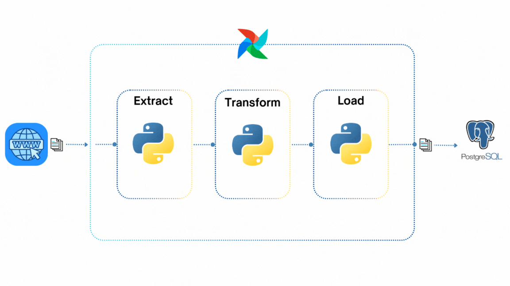
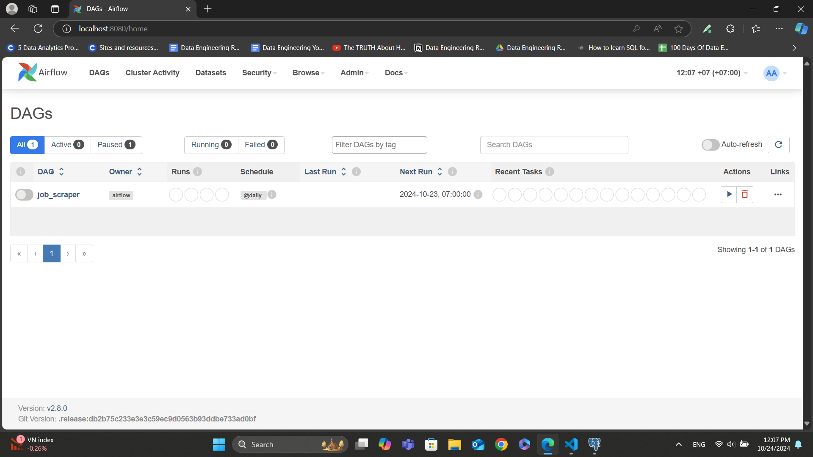
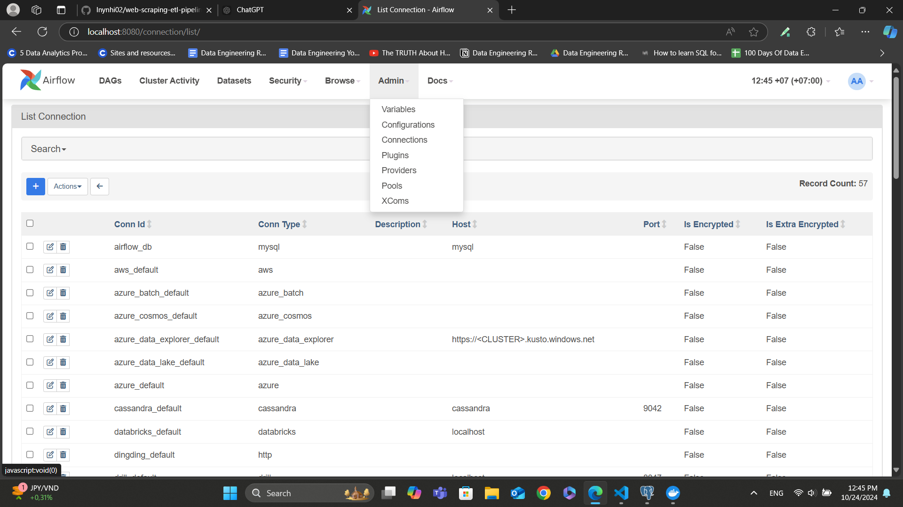
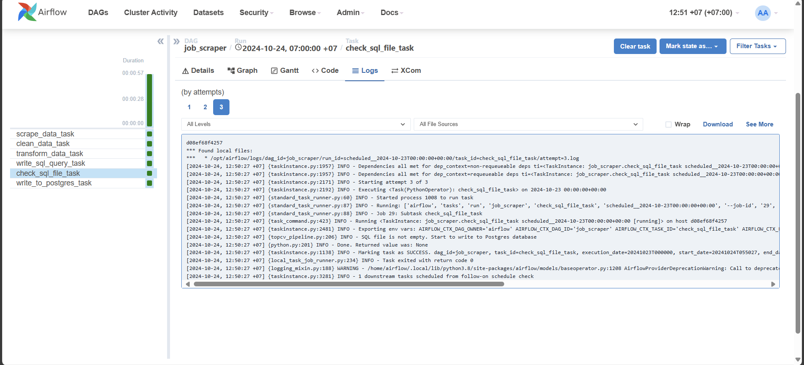
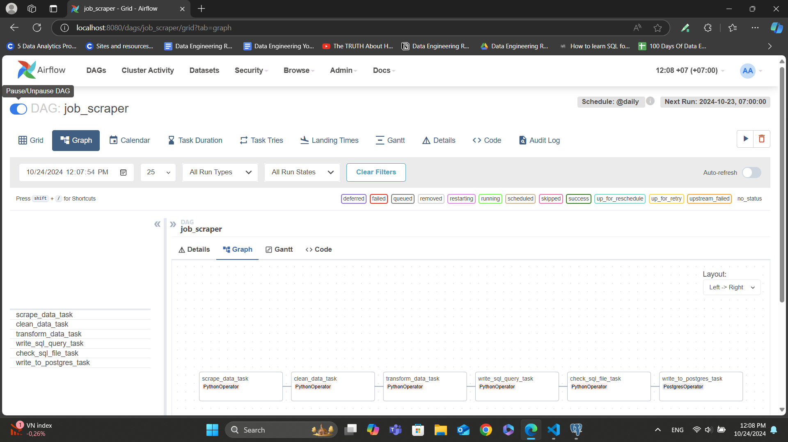
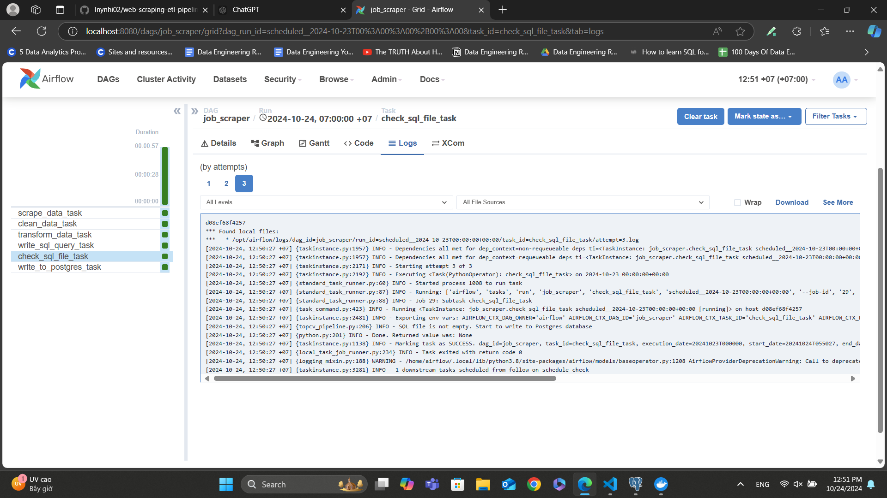
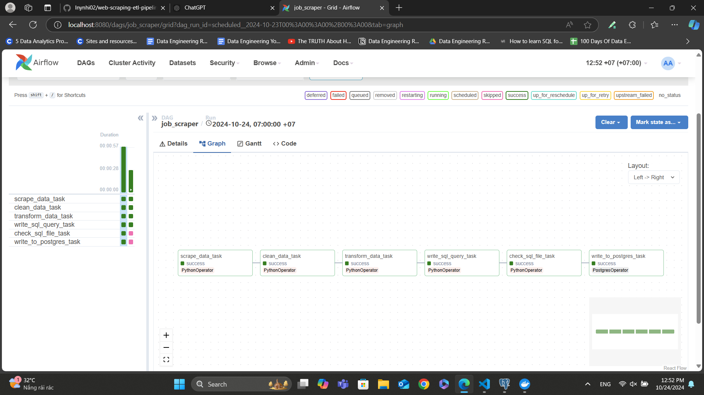

# 💼 JobScraper: Automated Job Data Pipeline

JobScraper is a web scraping and data pipeline project designed to automatically extract job postings from the TOPCV website(a website that posts job listings in Vietnam). The extracted data is cleaned, transformed, and stored in a structured database for easy querying and analysis. This project provides insights into the current job market and can be extended for data visualization and reporting purposes.

## Overview
Let's break down the ETL process step-by-step:

1. **Data Scraping**: Initially, data is collected from the [TOPCV](https://www.topcv.vn/viec-lam-it) website
2. **Data Processing**: After gathering the data, it undergoes a thorough cleaning and transformation process before being stored in the PostgreSQL database.
3. **Scheduling with Airflow**: All tasks—ranging from data scraping and cleaning to transformation and storage in the PostgreSQL database—are seamlessly orchestrated using Airflow, ensuring efficient workflow management.

<p align="center">
    

## Achievements
- Stored new jobs daily in the PostgreSQL database to keep an updated repository.
- Clean the 'title' and 'salary' columns to enhance query performance and ensure accurate data retrieval.
- Create a 'deadline_date' column to facilitate easy tracking of job deadlines.
- Utilize a stored procedure to update the 'deadline' column daily, for example, changing 'Còn 24 ngày để ứng tuyển' to 'Còn 23 ngày để ứng tuyển' the following day.

## 📕  Table Of Contents
* [⚙️ Local Setup](#️-local-setup)
* [💻 Deployment](#-deployment)
    - [Postgres Setup](#postgres-setup)
    - [Airflow Setup](#airflow-setup)
* [📝 Technical Notes](#-technical-notes)

## ⚙️ Local Setup
### Prerequisites
- Install [Docker](https://www.docker.com/products/docker-desktop/) for running Airflow
- Install [Python](https://www.python.org/)
- Install [PostgreSQL](https://www.postgresql.org/download/)

You can clone, fork, or download this GitHub repository on your local machine using the following command:
** **
        git clone https://github.com/lnynhi02/web-scraping-etl-pipeline.git

**Here is the overall structure of the project:**
** **
        web-scraping-etl-pipeline/
        ├── airflow/
        │   ├── dags/
        │   │   └── topcv_flow.py
        │   └── Dockerfile
        ├── config/
        │   └── config.ini
        ├── pipelines/
        │   ├── create_table.py
        │   ├── topcv_pipeline.py
        │   └── utils.py
        ├── tmp/
        │   ├── last_processed_time.json
        │   └── postgres_query.sql
        ├── .env
        ├── docker-compose.yaml
        └── requirements.txt

- The `airflow/` directory contains `dags/topcv_flow.py`, which holds the DAG responsible for orchestrating the TopCV-related workflow. The Dockerfile builds a custom image based on ***apache/airflow:2.8.0***, setting up the Airflow environment and installing Python dependencies. It also installs necessary system libraries, along with tools like ***pyvirtualdisplay***, ***playwright***, and ***Chromium*** for browser-based tasks. This setup is tailored for running Airflow workflows that involve web scraping or automated browser interactions.

- The `config/` directory contains a `config.ini` file that includes the configuration of your PostgreSQL database. Please change the values of the ***database*** and ***password*** to yours

- The `pipelines/` directory all the tasks of the pipeline:
    - The `create_table.py` for creating PostgreSQL tables
    - The `utils.py` file contains functions such as `clean_title`, `clean_salary`, `transform_salary`, and `caculate_dates`. These functions are primarily used to clean and transform data like job titles, salaries, and dates
    - The `topcv_pipeline.py` file utilizes functions from `utils.py` to clean and process the job data scraped from the web.

- The `tmp/` folder contains the `last_processed_time.json`, which stores the timestamp of the last processed job, and `postgres_query.sql`, which holds the `INSERT INTO` SQL statements for each job. These files are used to track processed jobs and write the scraped data into the PostgreSQL database.

- The `docker-compose.yaml` file configures Airflow services.

To set up our local development environment, begin by creating a ***virtualenv*** and installing ***psycopg2-binary***. This package is only needed to run `create_table.py` locally, so there's no need to install all the packages listed in `requirements.txt` at this point.The packages from `requirements.txt` will be installed later in the Docker environment via the `Dockerfile`.
1. Create a virtualenv environment `python -m venv venv`
2. Activate the venv environment
- Window Powershell: `venv/Scripts/Activate`
- Linux: `source venv/bin/activate`
3. Run `pip install psycopg2-binary==2.9.9`

And now we are good to go!!!

## 💻 Deployment
### **```Postgres Setup```**
Before setting-up our airflow configurations, let’s create the Postgres database that will persist our data. I prefer using the **pgAdmin 4** tool for this, however any other Postgres development platform can do the job.

When installing postgres, you need to setup a password that we will need later to connect to the database from the Spark environment. **You must remember the password to reconnect to the database servers**. You can also leave the port at 5432. If your installation has succeeded, you can start pgadmin and you should observe something like this window:
<p align="center">
  

Since we have many columns for the table we want to create, we opted to use a script with **psycopg2**, a PostgreSQL database adapter for Python, to create the table and add its columns. And we have installed the **psycopg2-binary** package in the `requirements.txt`

You can run the Python script with the following command:
** ** 
        python pipelines/create_table.py

I use `config.ini` to access the database configurations, allowing you to modify the application settings easily. Alternatively, if you prefer to use a different method, you can make slight adjustments to the script accordingly. The `config.ini` file looks as follow:
** **
    [database]
    host=host.docker.internal
    port=5432
    user=postgres
    password=change_me
    database=change_me

### **```Airflow Setup```**
Let’s take a look at the Directed Acyclic Graph (DAG) that will outline the sequence and dependencies of tasks, enabling Airflow to manage their execution.
** ** 
    from airflow.providers.postgres.operators.postgres import PostgresOperator
    from airflow.operators.python import PythonOperator
    from airflow import DAG
    import airflow.utils.dates
    import logging
    import sys
    import os

    sys.path.append(os.path.join(os.path.dirname(__file__), '..', 'pipelines'))
    from topcv_pipeline import scrape_data, clean_data, transform_data, write_sql_query, check_sql_file

    logging.basicConfig(level=logging.INFO)
    TEMPLATE_SEARCH_PATH = os.path.join(os.path.dirname(__file__), '..', 'tmp')

    default_args = {
        'owner': 'airflow',
        'start_date': airflow.utils.dates.days_ago(1)
    }

    with DAG(
        'job_scraper',
        default_args=default_args,
        template_searchpath=TEMPLATE_SEARCH_PATH,
        schedule_interval='@daily',
        catchup=False
    ) as dag:
        scrape_data_task = PythonOperator(
            task_id='scrape_data_task',
            python_callable=scrape_data,
            provide_context=True,
            op_kwargs={'url': 'https://www.topcv.vn/viec-lam-it'},
        )

        clean_data_task = PythonOperator(
            task_id='clean_data_task',
            python_callable=clean_data,
            provide_context=True
        )

        transform_data_task = PythonOperator(
            task_id='transform_data_task',
            python_callable=transform_data,
            provide_context=True
        )

        write_sql_query_task = PythonOperator(
            task_id='write_sql_query_task',
            python_callable=write_sql_query,
            provide_context=True
        )

        check_sql_file_task = PythonOperator(
            task_id='check_sql_file_task',
            python_callable=check_sql_file,
            provide_context=True
        )

        write_to_postgres_task = PostgresOperator(
            task_id='write_to_postgres_task',
            postgres_conn_id='postgres_conn',
            sql='postgres_query.sql',
            trigger_rule='all_success'
        )

    scrape_data_task >> clean_data_task >> transform_data_task >> write_sql_query_task >> check_sql_file_task >> write_to_postgres_task

- The dag includes all the tasks that are imported from the ``topcv_pipeline.py``
- The tasks are set to execute daily.
- The first task is the **Scrape Data Task**. This task scrapes data from the *TOPCV* website into a staging table in Postgres database, initiating the data processing workflow.
- The second task, **Clean Data Task**, will retrieve new, unprocessed jobs from the staging table, clean the 'title' and 'salary' fields by using ``clean_title()`` and ``clean_salary()`` function from ``utils.py``, and then push the cleaned data into XCom for later transformation.
- The third task is the **Transform Data Task**, which pulls cleaned data from XCom, uses the ``transform_salary()`` from ``utils.py`` to calculate the average salary, and then pushes the results back to XCom.
- The fourth task, **Write SQL Query Task**, pulls transformed data from XCom and then generates INSERT SQL commands for each job, saving them to ``postgres_query.sql`` for use with the ``PostgresOperator`` in downstream task.
- The fifth task, **Check SQL File Task**, checks whether the ``postgres_query.sql`` file contains any SQL commands. If it does, the downstream tasks will be executed; if the file is empty, the downstream tasks will be skipped.
- The final task is the **Write To Postgres Task**. It uses the **PostgresOperator** for execution, running the SQL commands from the ``postgres_query.sql`` file and storing the jobs in the PostgreSQL database.

Now, we just need to run Airflow in Docker. However, we need to create some environment variables that will be used by ***docker-compose***.
- Linux:
** **
    echo -e "AIRFLOW_UID=$(id -u)" > .env

- Windows, you need to find the UID by the command ``whoami /user``. Next, you take the 4 numbers at the end and run the following command:
** ** 
    Set-Content -Path .env -Value "AIRFLOW_UID=xxxx"

- Next, let's execute the following command to create the `airflow/logs/` folder.
** **
    PS: New-Item -ItemType Directory -Path "airflow/logs"
    Linux: mkdir -p airflow/logs

- Finally, create the network with ``docker network create airflow`` and start Airflow in Docker by running ``docker-compose up -d``.

- Now we can access the Airflow UI at ``localhost:8080``. Use the username ``airflow`` and the password ``airflow`` to log in.
<p align="center">
  

- We can see the dag `job_scraper`. 
<p align="center">
  

- Before running the DAG, we need to establish a ***Postgres Connection*** in Airflow to enable connectivity with the Postgres database. This connection is essential for executing the `write_to_postgres_task` using the `PostgresOperator`.

- Navigate to the **Admin** section at the top and select **Connections**. Then, click on the **+** icon to add a new connection.
<p align="center">
  

- Since we are connecting from Airflow running in a Docker container, set the host to **host.docker.internal**. Ensure you also enter your **database** name and **password** accordingly. The **Connection ID** will later be utilized in the **postgres_conn_id** parameter within the `write_to_postgres_task`
<p align="center">
  

- Let's go and run the DAG.
<p align="center">
  

- You can monitor the log for each task to gain insights into the scraping process and see how many jobs have been collected. 
<p align="center">
  

<p align="center">
  

For further details about its operation, please refer to the [Technical Notes](#technical-notes).

### **```SQL Query```**
- Once all the data is loaded into the database, we need to perform some cleaning. The `salary` column some text like **Thỏa thuận** which means **contract**, we will set it to ***NULL*** and change the data type for improved querying.
** ** 
    UPDATE jobs_table
    SET salary = NULL
    WHERE salary = 'Thỏa thuận';

    ALTER TABLE jobs_table
    ALTER COLUMN salary TYPE numeric USING salary::numeric;

    ALTER TABLE jobs_table
    ALTER COLUMN salary TYPE integer USING ROUND(salary);

- We need to create a stored procedure with the purpose of updating the remaining time for jobs that are still open for applications.
** ** 
    CREATE OR REPLACE PROCEDURE update_deadline()
    LANGUAGE plpgsql
    AS $$
    DECALRE
        job_record RECORD,
        time_remaining INTERVAL;
    BEGIN
        FOR job_record IN SELECT * FROM jobs_table LOOP
            time_remaining = jobs_table.deadline_date - CURRENT_TIMESTAMP;
            
            IF time_remaining > INTERVAL '0 seconds' THEN 
                IF time_remaining < INTERVAL '1 minutes' THEN
                    UPDATE jobs_table
                    SET deadline = 'Còn ' || EXTRACT(SECOND FROM time_remaining) || ' giây để ứng tuyển'
                    WHERE link = job_record.link;
                ELSEIF time_remaining < INTERVAL '1 hour' THEN
                    UPDATE jobs_table
                    SET deadline = 'Còn ' || EXTRACT(MINUTE FROM time_remaining) || ' phút để ứng tuyển'
                    WHERE link = job_record.link;
                ELSEIF time_remaining < INTERVAL '1 day' THEN 
                    UPDATE jobs_table
                    SET deadline = 'Còn ' || EXTRACT(HOUR FROM time_remaining) || ' giờ để ứng tuyển'
                    WHERE link = job_record.link;
                ELSE
                    UPDATE jobs_table
                    SET deadline = 'Còn ' || EXTRACT(DAY FROM time_remaining) || ' ngày để ứng tuyển'
                    WHERE link = job_record.link;
                END IF;
            
            ELSE
                UPDATE jobs_table
                SET deadline = 'Đã hết thời gian ứng tuyển'
                WHERE link = job_record.link;
            END IF;
        END LOOP;
    END;
    $$;

- To gain better insights into the data, let's execute some queries.

### **```Technical Notes```**
** **
    def read_last_processed_time():
        try:
            with open(LAST_PROCESSED_FILE, "r") as file:
                return datetime.fromisoformat(json.load(file)['last_processed'])
        except Exception as e:
            logging.error(f"Error reading last processed time from file: {e} -> So we will return None")
            return None

    def write_last_processed_time(last_processed):
        try:
            with open(LAST_PROCESSED_FILE, "w") as file:
                json.dump({'last_processed': last_processed.isoformat()}, file)
        except Exception as e:
            logging.error(f"Error writing last processed time to file: {e}")

    def get_connection():
        config_file = os.path.join(os.path.dirname(__file__), '..', 'config.ini')
        config = configparser.ConfigParser()
        config.read(config_file)

        try:
            return psycopg2.connect(
                host=config['postgres']['host'],
                port=config['postgres']['port'],
                dbname=config['postgres']['database'],
                user=config['postgres']['user'],
                password=config['postgres']['password']
            )
        except Exception as e:
            logging.error(f"Error creating connection to Postgres: {e}")

    def scrape_data(**kwargs):
        url = kwargs['url']

        display = Display(visible=0, size=(1920, 1080))
        display.start()

        scraped_jobs = []
        try:
            with sync_playwright() as p:
                browser = p.chromium.launch(headless=False)
                page = browser.new_page()
                page.goto(url)
                time.sleep(3)

                jobs = page.query_selector_all("div.job-item-2.job-item-default.bg-highlight.job-ta")
                for job in jobs:
                    title = job.query_selector("h3.title").inner_text().strip()
                    link = job.query_selector("a").get_attribute("href")
                    salary = job.query_selector("label.title-salary").inner_text().strip()
                    company = job.query_selector("a.company").inner_text().strip()
                    update = job.query_selector("label.deadline").inner_text().strip()
                    location = job.query_selector("label.address").inner_text().strip()
                    deadline = job.query_selector("label.time").inner_text().strip()

                    update_date, due_date = caculate_dates(update, deadline)
                    scraped_jobs.append({
                        'title': title,
                        'link': link,
                        'salary': salary,
                        'company': company,
                        'update': update,
                        'update_date': update_date,
                        'location': location,
                        'deadline': deadline,
                        'due_date': due_date
                    })
                
                browser.close()

            write_to_staging_table(scraped_jobs)

        except Exception as e:
            logging.error(f"Error scraping data: {e}")

        finally:
            display.stop()

    def write_to_staging_table(scraped_jobs):
        conn = get_connection()
        cur = conn.cursor(cursor_factory=DictCursor)

        try:
            for job in scraped_jobs:
                cur.execute("""INSERT INTO staging_table VALUES (%s, %s, %s, %s, %s, %s, %s, %s, %s)""", 
                (job['title'], job['link'], job['salary'], job['company'], job['update'], job['update_date'], job['location'], job['deadline'], job['due_date']))
        except Exception as e:
            logging.error(f"Error writing data to staging table: {e}")
        finally:
            conn.commit()
            cur.close()
            conn.close()

    def clean_data(**kwargs):
        conn = get_connection()
        cur = conn.cursor(cursor_factory=DictCursor)

        query = "SELECT * FROM staging_table"
        last_processed_time = read_last_processed_time()

        if last_processed_time:
            query += " WHERE update_date > %s"
            cur.execute(query, (last_processed_time,))
        elif last_processed_time is None:
            cur.execute(query)

        scraped_jobs = cur.fetchall()
        cleaned_jobs = []
        for job in scraped_jobs:
            
            cleaned_jobs.append({
                'title': clean_title(job['title']),
                'link': job['link'],
                'salary': clean_salary(job['salary']),
                'company': job['company'],
                'update': pendulum.instance(job['update_date']).in_timezone('Asia/Ho_Chi_Minh'),
                'location': job['location'],
                'deadline': job['deadline'],
                'due_date': pendulum.instance(job['due_date']).in_timezone('Asia/Ho_Chi_Minh')
            })

            logging.info(f"Job '{job['title']}' has update time: {job['update_date']}")

        logging.info(f"Cleaned {len(cleaned_jobs)} job(s)")

        conn.commit()
        cur.close()
        conn.close()

        kwargs['ti'].xcom_push(key='cleaned_data', value=cleaned_jobs)

    def transform_data(**kwargs):
        cleaned_jobs = kwargs['ti'].xcom_pull(key='cleaned_data', task_ids='clean_data_task')

        transformed_jobs = []
        for job in cleaned_jobs:
            transformed_jobs.append({
                'title': job['title'],
                'link': job['link'],
                'salary': transform_salary(job['salary']),
                'company': job['company'],
                'update': pendulum.instance(job['update']).in_timezone('Asia/Ho_Chi_Minh'),
                'location': job['location'],
                'deadline': job['deadline'],
                'due_date': pendulum.instance(job['due_date']).in_timezone('Asia/Ho_Chi_Minh')
            })

        logging.info(f"Transformed {len(transformed_jobs)} job(s)")

        kwargs['ti'].xcom_push(key='transformed_data', value=transformed_jobs)

    def write_sql_query(**kwargs):
        transformed_jobs = kwargs['ti'].xcom_pull(key='transformed_data', task_ids='transform_data_task')
        postgres_sql_file = os.path.join(os.path.dirname(__file__), '..', 'tmp', 'postgres_query.sql')

        try:
            with open(postgres_sql_file, "w") as file:
                if not transformed_jobs:
                    logging.info("There are no available jobs to write")
                else:
                    last_processed = transformed_jobs[0]['update']
                    for job in transformed_jobs:
                        file.write(
                            f"INSERT INTO jobs_table VALUES ("
                            f"'{job['title']}', "
                            f"'{job['link']}', "
                            f"'{job['salary']}', "
                            f"'{job['company']}', "
                            f"'{job['update']}', "
                            f"'{job['location']}', "
                            f"'{job['deadline']}', "
                            f"'{job['due_date']}');\n"
                        )
                        if job['update'] > last_processed:
                            last_processed = job['update']

                    logging.info(f"Wrote {len(transformed_jobs)} jobs to the SQL file")
                    write_last_processed_time(last_processed)
                    logging.info("Successfully update the last processed time")
        except Exception as e: 
            logging.error(f"Error writing SQL query to file{e}")

    def check_sql_file(**kwargs):
        postgres_sql_file = os.path.join(os.path.dirname(__file__), '..', 'tmp', 'postgres_query.sql')

        if os.path.exists(postgres_sql_file) and os.path.getsize(postgres_sql_file) > 0:
            logging.info("SQL file is not empty. Start to write to Postgres database")
        else:
            logging.info("No SQL queries to execute.")
            raise AirflowSkipException("Skipping task because SQL file is empty")

- **Write to Staging Table:** In the `write_to_staging_table` function, data is written to a staging table to preserve the original dataset before any cleaning processes are applied. This allows for data recovery if needed and ensures that no data is lost during processing.

- **Usage of DictCursor:** In the `clean_data` function, we utilize `DictCursor` to access table columns as **key-value pairs**. Using `DictCursor` enables direct access to values, for example by calling `job['title']`, which enhances code readability and maintainability.

- **Filtering New Jobs:** When querying data in the `clean_data` function, only jobs with an update_date greater than last_processed_time are selected. This ensures that only new jobs are retrieved, avoiding the reprocessing of existing jobs.

- **Pendulum for Timezone Management:** The pendulum library is used before pushing data to XCom in each task to ensure that timestamps are correctly converted to the **'Asia/Ho_Chi_Minh'** timezone. This is crucial because Airflow automatically converts timestamps to UTC, which can lead to discrepancies if not managed carefully. Please change the timezone to your preferred timezone as needed.

- **Data Flow Using XCom:** The DAG utilizes Airflow's XCom feature to pass data between tasks. The `clean_data` task pushes cleaned job data into XCom, which is subsequently pulled by the `transform_data` task for further processing. Finally, the `write_sql_query` task retrieves the transformed data to generate SQL insert commands.

- **Error Handling:** The `check_sql_file` task verifies whether the `postgres_query.sql` file contains any `INSERT` commands. If `INSERT` commands are present, it proceeds to execute the downstream tasks. Conversely, if no commands are found, it raises an `AirflowSkipException`, causing both the current task and its downstream tasks to be skipped.